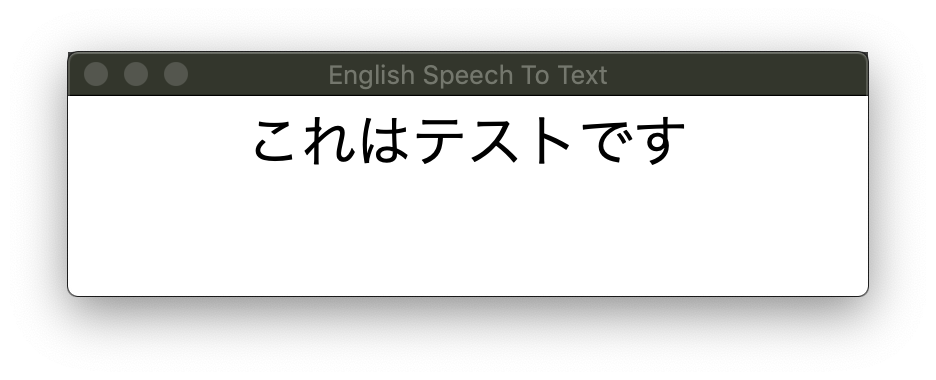

# English Speech To Japanese Text Application

if you say `This is test`

then application show 



# Usage

## install tkinter 
### mac
```
brew install tcl-tk
```

### ubuntu 
```
sudo apt install python3-t
```

## install requirements.txt
``` bash
pip install -r requirements.txt
```
## run 

1. Run application
```
python3 speech_to_text_server.py
```

2. say something to microphone

3. application will show you're english speech to japanese text


